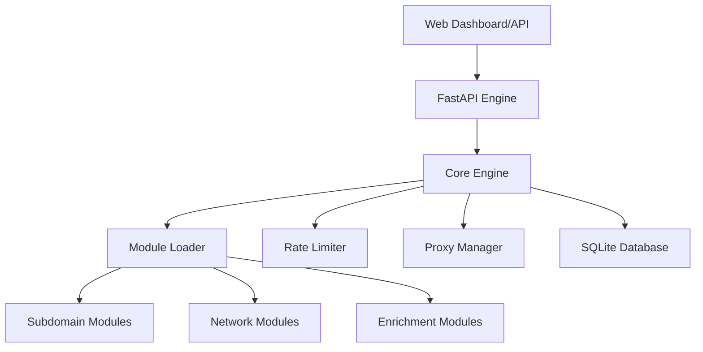

# ReconMaster – Final Project Report

## Overview
ReconMaster is an advanced, modular OSINT automation framework for reconnaissance, subdomain discovery, and enriched service intelligence. Following a series of stabilization and refactoring phases, the project has transitioned to a professional, GitHub-ready standard with high-concurrency async orchestration and a minimalist greyscale user experience.

---

## 🚀 Key Accomplishments

### 1. Architectural Stabilization
- **Core Engine Refactor**: Orchestrated parallel module execution into logical phases (Discovery, Enumeration, Detection, Enrichment).
- **Module Standardization**: Applied Google-style docstrings, strict type hints, and uniform logging/error handling to all 15+ reconnaissance modules.
- **Asynchronous Optimization**: Fully optimized `asyncio` workflows, ensuring non-blocking I/O even when using synchronous third-party libraries via `asyncio.to_thread`.
- **Infrastructure Upgrades**: Centralized proxy management (HTTP/SOCKS/Tor) and token-bucket rate limiting to ensure stealth and target-friendly scanning.

### 2. UI/UX Transformation
- **Greyscale Aesthetic**: Adopted a professional, minimal greyscale palette (Black/White/Grey) for improved readability and a "high-end security tool" feel.
- **Responsive Dashboard**: Updated the FastAPI/Bootstrap frontend for better telemetry visualization, including live modular progress and detailed scan reports.
- **Visual Recon**: Enhanced integration with Playwright for reliable, concurrent screenshot capture.

### 3. Documentation & Readiness
- **Comprehensive Overhaul**: Rewrote `README.md` as a professional landing page.
- **Technical Guides**: Created `MODULE_CREATION.md` for developers and `API_REFERENCE.md` for programmatic integration.
- **Code Quality**: Verified all modules for PEP 8 compliance and consistent design patterns.

---

## 🏗️ Technical Architecture

### Component Diagram

### Module Suite
| Module | Description | Dependencies |
| :--- | :--- | :--- |
| **Subdomain** | Multi-source discovery (crt.sh, Anubis, etc.) | `aiohttp` |
| **Portscan** | Async TCP service discovery | `asyncio` |
| **HTTP** | Web service profiling & title extraction | `beautifulsoup4` |
| **Screenshot** | Automated visual evidence gathering | `playwright` |
| **Shodan** | IP enrichment and vulnerability metadata | `shodan` |
| **GitHub** | Sensitive leak discovery via Dorking | `PyGithub` |

---

## 🔒 Security & Performance
- **Isolation**: Each module runs in its own task with guarded error handling.
- **Rate Control**: Global semaphore and token-bucket limits prevent IP blacklisting.
- **Anonymity**: Full support for Tor/SOCKS proxies at the engine level.

## 📈 Future Roadmap
- **Plugin Marketplace**: Dynamic loading of community-contributed modules.
- **Distributed Scanning**: Master/Worker nodes for large-scale enterprise reconnaissance.
- **Advanced NLP**: AI-driven analysis of page titles and banners for automated classification.

---
**Prepared by**: Antigravity AI
**Date**: February 2026
**Status**: Stable / Production Ready
